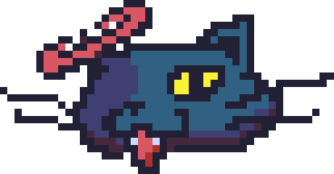

# NekoNekoRB 

Tiny desktop pet + Pomodoro timer.\
Toy project to experiment with Golang & raylib-go.

## Features
- **Desktop pet**: idle, sleep, drag, and fall animations
- **Pomodoro overlay**: simple work/break cycle display
- **Frameless, always-on-top, transparent window**

## Future Updates
- **Dynamic pomodoro clock**: pause, reset, and customize work/break durations
- **Settings tab/window**: configure timer durations and pet appearance

## Run (Windows)
- Double-click `bin/NekoNekoRB.exe`.
- Keep the working directory as `bin/` so `assets/` can be found.

## Controls
- **Left click**: toggle idle/sleep
- **Drag**: hold left click and move to reposition
- **Right click**: start Pomodoro
- **Esc**: quit

Requirements: Go 1.24+, Windows.\
Uses [`github.com/gen2brain/raylib-go/raylib`](https://github.com/gen2brain/raylib-go).
