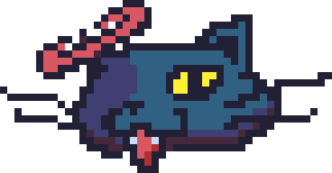

# NekoNekoRB!! 

Tiny desktop pet + pomodoro timer.  
Made with Go and raylib-go as a fun little side project.  

## Features
- Animated pet (idle, sleep, drag, fall)  
- Always-on-top transparent window  
- Simple Pomodoro cycle display  

## Coming Soon
- Better (cuter) sprites  
- Proper Pomodoro controls (pause, reset, customize)  

## Notes
This is an early test release using placeholder sprites.  
Expect things to break, change, or look silly.  

## About
Created by *pijonClif* — experimenting with Go + raylib-go.  

